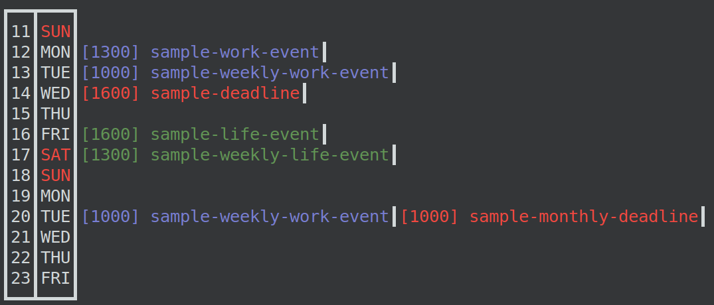
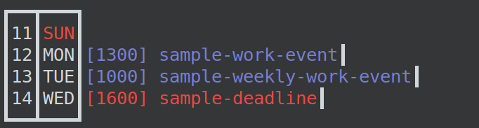
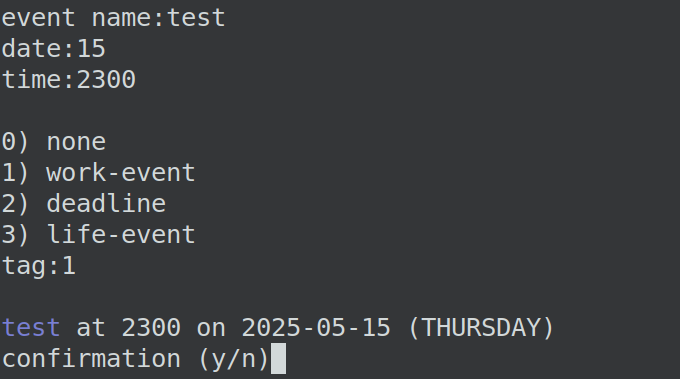
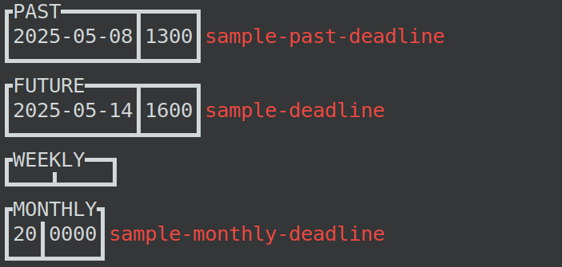

# Calendar

A terminal-based calendar, written in python



## Installation:

Run the following commands:

```
git clone https://github.com/MathewKJ2048/calendar
python ./src/main.py ./test.json
```

Use a custom `.json` file to store your own calendar in place of `test.json`

## Use:

### Display:

By default, the calendar shows the maximum number of lines which fit on the terminal where it's called, starting at the current day. For a custom number of lines, append the number as an argument, such as:

```
python ./src/main.py ./test.json 4
```



### Adding events:

The calendar can be edited directly via the `.json` file. To add events, running the following starts the process to add an event.

```
python ./src/main.py ./test.json add
```



The date can be specified using either `DD`, `MM-DD` or `YYYY-MM-DD`. The missing details are filled in using the same details of the current day. In this example, the event is added for the 15<sup>th</sup> of the current month and year. For days in the current week, entering the name of the weekday results in a resolution to the closest date where that weekday occurs. For instance, `tue`, `tuesday`, `Tue` etc. are resolved to `11-05-2025`.

If the time field is unspecified, the time defaults to `0000` of that day, which is the first minute of that day.

### Search:

Events can be searched using a search string which is matched to the date, day, tag, time and event name using the `search <keyword>` argument.

```
python ./src/main.py ./test.json search deadline
```




